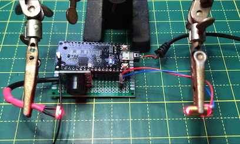
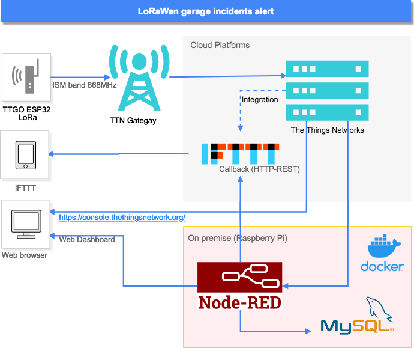
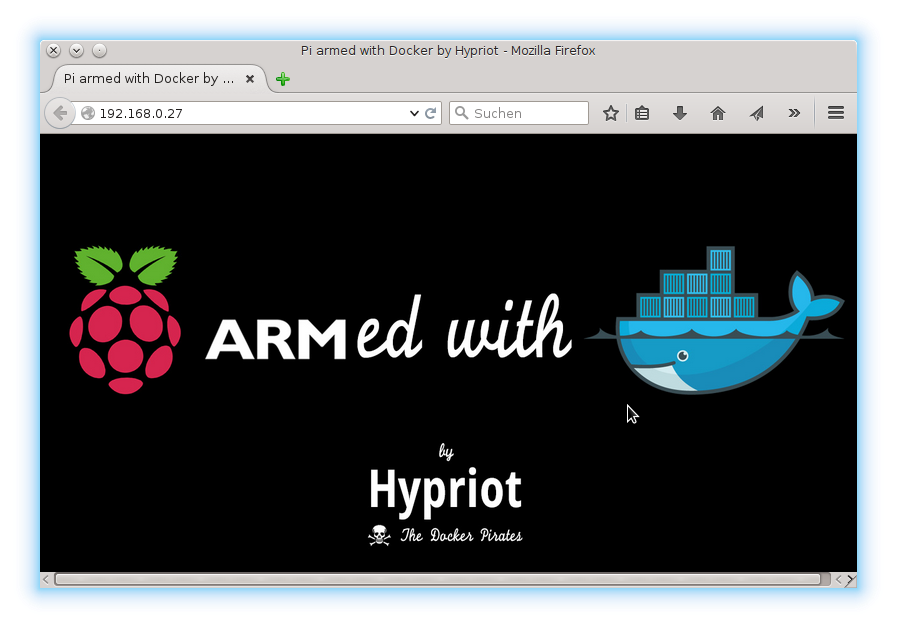

# Un barrera láser, LoRaWan y Docker para vigilar mi garage 

Se me ocurrió que alternativa para proteger el acceso a la plaza de garage comunitaria sin tener que instalar separaciones físicas. Se trata de visibilizar una barrera virtual que detecta y notifica intrusiones.

En esta primera iteración, el dispositivo sólo tendrá un sensor de luz para detectar la interrupción de un haz láser a fin de avisar del paso de una persona. Más adelante podríamos incluir otros detectores de movimientos como un PIR (Passive infrared sensor). O la conexión son un sistema de grabación de imagen, por ejemplo.


El montaje se basa en un procesador ESP32 programado en C++ con las librerías de Arduino LMIC desarrolladas por IBM para los chips LoRa SX1272, SX1276 que son compatibles con muchas placas de prototipo LoRa montadas con micro-procesadores ESP8266. 

El sensor se basa en un LED láser y una foto-resistencia que se lee por un puerto de conversión Analógico/Digital. El programa ajusta los niveles de luz umbral al arrancar la placa. De manera que si se bloquea la luz se desencadena el proceso de aviso acústico y envío de mensaje de alerta por LoRa.

La parte de _backoffice_ es soportada por la plataforma [The Thing Networs (aka TTN)](https://www.thethingsnetwork.org/) e [IFTTT](https://ifttt.com/). La información finalmente se procesa en flujos de un programa en Node-RED que corre en un contenedor Docker sobre una Raspberry Pi 3B+ con el sistema operativo Raspbian. La foto de esta arquitectura sería esta:
<br>
<br>


## Demo
Demo de proceso completo, detección y notificación:
[](https://youtu.be/qcct-dORirM)

## Material utilizado
- He utilizado la *placa* [TTGO LoRa32 V2.0 868 MHz](https://es.aliexpress.com/item/32850086038.html). Basada en el microprocesador ESP32 y en el chip LoRa SX1276, con WiFi y BlueTooth.
- La **fuente láser** es un pequeño [Diodo de 5mW y longitud de onda roja de 650 nm.](https://es.aliexpress.com/item/32400936169.html)
- El **receptor** es una resistencia sensible a la luz de 12mm [GL12528 LDR](https://es.aliexpress.com/item/32292338404.html)
- Y como **altavoz** un [buzzer pensado para montajes de Arduino](https://es.aliexpress.com/item/32849730395.html)
- Mini [**espejos** acrílicos](https://es.aliexpress.com/item/1861870525.html)

## El montaje


<br>


## Registro del sensor en la nube
Vamos a utilizar los servicios de TTN que enrutarán el mensaje desde el _gateway_ que reciba por radiofrecuencia el paquete de datos hasta el _endpoint_ que consumirá la aplicación que tome acción con la información contenida en la trama da datos. 

Este dispositivo es del tipo ABP (Activation-by-personalisation) lo que significa que se identificará en la red con un _DevAddr_ y una _Session key_ preconfigurada. Para ello tenemos que completar el registro de una aplicación y un dispositivo. Estos son los pasos a seguir:

### Registro de la aplicación
Los registros se comunican con la aplicación en la que han sido registrados. Para registras un dispositivo, primero hay que añadir una aplicación.


En la consola, selecciona _APPLICATION_ y pulsa _add application_ en la siguiente pantalla. 
- Para el _Application ID_, elige un identificador único, en minúsculas, puedes usar caracteres alfanuméricos peor no guiones ´-´ consecutivos.
- Para  _Description_, elige la descripcion que prefieras.
- No hace falta poner nada en _Application EUI_ 
- En _Handler registration_ deja el valor predeterminado: ttn-handler-eu
- Presiona _Add Application_ para finalizar

Ahora seremos redirigidos a la página con la nueva aplicación añadida donde puedes encontrar la _app EUI_ y el _Access Keys_ generados.
<br>


### Registro del dispositivo


En TTN un dispositivo (devide) representa la configuración de lo que también llama nodo (node) que a fin de cuentas es nuestro circuito. 
Al acceder al formulario de registro, únicamente tenemos que rellenar el _Device ID_ que será el nombre único de este nodo. Es preferible pulsar el icono marcado en la imagen para que se genere automáticamente el _Device EUI_.


<br>
<br>
<br>
<br>
<br>
<br>
Finalmente pulsaremos _Register_ y pulsaremos el icono con el nombre de nuestro nuevo dispositivo para ver sus datos de configuración. Aquí encontraremos los parámetros que necesitamos por ser un dispositivo de tipo ABP. Y que tendremos que pasar al fichero de configuración settings.h que se cargará en el _sketch_ del IDE de Arduino.
Pero el formato para las Keys es diferente. Encontrarás aquí una hoja excel (Encode_EUI.xlsx) que te facilitará esta tarea.

```
// TTN Configuration
// LoRaWAN NwkSKey, network session key provided by TTN Console (https://console.thethingsnetwork.org) in Device settings form:
static const PROGMEM u1_t NWKSKEY[16] = {0x8F,0xDA,......};
// LoRaWAN AppSKey, application session key provided by TTN Console (https://console.thethingsnetwork.org) in Device settings form:
static const u1_t PROGMEM APPSKEY[16] = {0xE5,0x0A,......};
// LoRaWAN end-device address (DevAddr)
static const u4_t DEVADDR = 0x12345678 ; // <-- Change this address for every node!

// Other params
const int update_time_alive = 150000;
const int PhotoCell = 2; 
const int Buzzer = 15;
```

### Formato de la trama

Tendremos que volver a la pantalla de _Application Overbiew_ para hacer una última configuración. Pulsando en la pestaña de _Payload Formats_ accedemos al formulario donde se permite poner un script para decodificar la trama de datos de nuestro mensaje LoRa. En nuestro caso este es el formato:


## Configuración servidor local



La arquitectura elegida para el back y front está pensada para tener unos mínimos costes de operación y ser escalable. El uso de contenedores nos permitirá añadir nuevos dispositivos (Nodos TTN) rápidamente con su propio _dashboard_ Node-RED ejecutado en el mismo servidor. 

El servidor utilizado ha sido una Raspberry Pi 3B+. Actualmente no es el modelo más potente pero suficiente para ejecutar varios contenedores. Las tareas iniciales de configuración para instalar el sistema operativo Raspbian, y MySQL pueden ser fácilmente encontradas y son estándar. Los contenedores Docker y Node-RED con todos sus complementos necesarios para que se pueda ejecutar el flujo completo. Los describo a continuación.

### Instalación de contenedores
Para estas configuraciones me he basado en el documento: [The easy way to set up Docker on a Raspberry Pi](https://www.freecodecamp.org/news/the-easy-way-to-set-up-docker-on-a-raspberry-pi-7d24ced073ef/). Aquí resumo los pasos a seguir:

1. Instalar Docker en RPI:
```
sudo groupadd docker
sudo gpasswd -a $USER docker newgrp docker
docker run hello-world
```
2. Se crea el contenedor. Tendremos que mapear con puertos de salida diferentes, 1881 para este contenedor. A fin de que no coincida con los otros. 
```
docker run -d -it -p 1881:1880 --name domohome-garage  nodered/node-red
```

### Complementos de Node-RED
La aplicación Node-RED no incluye por defecto los nodos que necesitaremos para integrarnos con TTN, con MySQL o para mostrar un interface de usuario, los _dashboard_. En principio, todos se podrían instalar desde la opción _Manage Palette_ de la aplicación de administración a la que deberíamos acceder en la dirección del tipo: http://192.168.1.???:1881

**Nodos de _dashboard_**

Instalación estándar. Buscando el modulo ¨node-red-dashboard¨ en _install_ desde la opción de menú de _Manage Palette_ de la aplicación.

**Nodos intrgración con TTN**

Necesitaremos acceder al contenedor con una sesión SSH [Más info aquí](https://phoenixnap.com/kb/how-to-ssh-into-docker-container)
```
docker exec -it domohome-garage /bin/bash
```
Instalaremos ahora los nodos con el gestor de paquetes npm:
```
npm install node-red-contrib-ttn
```

**Nodos MySQL**

Desde la sesión SSH anterior ejecutamos:
```
npm install node-red-node-mysql
```
Para ampliar información sobre el uso y ejemplos la web de TTN tiene esta página: https://www.thethingsnetwork.org/docs/applications/nodered/

## Aplicación cliente


En el flujo de Node-RED se trata y muestra gráficamente los mensajes entregados por el servicio TTN. El _payload_ del mensaje contiene dos valores diferentes: ¨alert¨ cuando el haz láser es interrumpido y ¨alive¨ cada 10 minutos. Además se incluye una lógica para mostrar un estado de no disponible cuando en 11 minutos no ha llegado mensaje alguno.

Para importar el flujo deberemos acceder a la aplicación Node-RED que tenemos arrancada en el Docker en una dirección del tipo http://192.168.1.???:1881. Encontraremos la opción de importar pulsando el botón de menú tipo hamburguesa. Lo más fácil es copiar al portapapeles de equipo el contenido del fichero garage-cerberus_flows.json y pegarlo en la pantalla:
<br>


Tras pulsar el botón de ¨import¨ tendrás la vista de los nodos y los flujos. Pero hay dos de ellos que no están correctamente configurados.

### Configurar dispositivo TTN
Abre las propiedades del nodo **TTN domohome_sensor_garage uplink** y busca los nombres y la Key en la consola de TTN según las siguientes correspondencias:


### Configurar integración con IFTTT
La integración con IFTTT (If This Then That) está montada con una sencilla llamada a su _endpoint_ REST utilizando en nodo tipo _http request_ con el siguiente formato. 
<br>
```
https://maker.ifttt.com/trigger/domohome_garage_intruder/with/key/???????????
```
<br>
Donde sustituiremos las interrogantes por la Key que encontramos en esta configuración del componente Maker _Webhooks_ en IFTTT. Que configuraremos para recibir el evento disparar los avisos nativos en nuestra móvil a fin de tener notificación de la alarma.


### Dashboard 


El resultado final es una pantalla responsiva donde se nos muestra el último evento, el histórico y la posibilidad de desactivar los avisos. Accederemos con la misma URL que para la administración pero con el sufijo /ui: http://192.168.1.???:1881/ui
